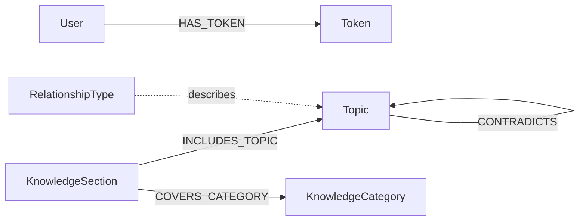

# NexusKnowledge

NexusKnowledge is a full-stack knowledge graph explorer. It lets a non-technical user browse concepts, filter and search the catalogue, inspect typed relationships, and follow multi-hop connections between ideas.

The application uses Django REST Framework for the API, React and Vite for the web interface, and CognoDB through the official Neo4j Python driver. User accounts, access tokens, topics, categories, sections, and relationships are stored in CognoDB; Django's ORM is not used.

## Use Case

Technical knowledge is connected: a framework depends on a language, a model builds on mathematics, and a tool may belong to a wider engineering practice. NexusKnowledge makes those connections explorable instead of presenting every concept as an isolated row or article.

The Explorer provides:

- Curated learning sections
- Topic search and category filtering
- Topic articles with examples and resources
- Direct relationship inspection
- Related-topic discovery across one to four hops
- Prerequisite-chain and application queries
- Graph counts and relationship explanations

## Why A Graph Database?

The important questions in this use case are about paths, not just individual records. For example:

- Which foundations lead to Deep Learning through several `BUILDS_ON` relationships?
- Which concepts are connected to Machine Learning within two hops, regardless of the relationship type?
- Which topics does Python apply to, and which tools are part of the resulting ecosystem?

In a relational schema, these questions require recursive queries, multiple join tables, and separate logic for each relationship type. CognoDB stores the typed edges directly and lets the application express those questions with openCypher variable-length traversals. Adding a new relationship type does not require changing a join-table schema.

## Data Model

The main learning graph uses `Topic` nodes. Supporting nodes keep curated content and relationship explanations queryable as graph data. Authentication data is also stored in the same CognoDB instance.



### Node properties

| Label | Important properties |
| --- | --- |
| `Topic` | `name` (unique), `description`, `category`, `importance` (1-10), article content, examples, resources, images, code and Cypher examples, `created_at` |
| `KnowledgeCategory` | `name` (unique), graph/database guidance, `created_at` |
| `KnowledgeSection` | `name` (unique), `display_order`, objective, introduction, example path, `created_at` |
| `RelationshipType` | `name` (unique), description, `created_at` |
| `User` | `id`, email, name, phone, password hash and salt, status flags, timestamps |
| `Token` | unique token key, `token_type`, `session_id`, creation and expiry timestamps |

### Relationship meanings

`BUILDS_ON` points from an advanced topic to the foundation it builds on. Therefore, to find prerequisites for a selected topic, the query follows the edge in reverse. `APPLIES_TO` points from a concept to the area where it is applied. `PART_OF`, `RELATED_TO`, and `CONTRADICTS` capture composition, association, and opposition respectively.

## Repository Structure

```text
backend/
  backend/                 Django settings, URLs, middleware, connection helpers
  knowledge/               Graph views, queries, connection manager, tests
  users/                   CognoDB-backed authentication and token APIs
  seed_data.py             Idempotent graph seed script
  postman_collection.json  API request collection
frontend/
  src/pages/               Home, authentication, and graph explorer screens
  src/services/            Axios API and authentication services
  src/context/             Authentication state
  src/styles/              Page and component styles
```

## Prerequisites

- Python 3.8 or newer
- Node.js 16 or newer
- A CognoDB Cloud account and free `c0` instance

## CognoDB Setup

1. Sign up at [console.cognodb.com/signup](https://console.cognodb.com/signup).
2. Create a free `c0` instance and select a region.
3. Save the generated password immediately; CognoDB shows it once.
4. Use the instance URI in the form `bolt+s://<instance-id>.databases.cognodb.cloud`.

The application reads all secrets and deployment settings from environment variables. Create `backend/.env` locally, and never commit it:

```env
DJANGO_SECRET_KEY=replace-with-a-long-random-secret
DEBUG=False
ALLOWED_HOSTS=localhost,127.0.0.1
CORS_ALLOWED_ORIGINS=http://localhost:5173
NEO4J_URI=bolt+s://your-instance-id.databases.cognodb.cloud
NEO4J_USER=cognodb
NEO4J_PASSWORD=your-cognodb-password
```

For production, set the same variables in the hosting provider's secret/configuration panel. Do not put the CognoDB password or URI in frontend code.

## Run Locally

### Backend

```powershell
cd backend
python -m venv venv
venv\Scripts\activate
pip install -r requirements.txt
python manage.py check
python seed_data.py
python manage.py runserver
```

The API runs at `http://localhost:8000`. The seed script clears only the knowledge graph labels (`Topic`, `KnowledgeCategory`, `KnowledgeSection`, and `RelationshipType`), preserves users and tokens, creates constraints, and reloads the sample graph.

### Frontend

```powershell
cd frontend
npm install
npm run dev
```

The Vite development server runs at `http://localhost:5173` and proxies `/api` requests to Django. For a production build:

```powershell
npm run lint
npm run build
```

## API

The API base path is `/api`. Knowledge endpoints require `Authorization: Bearer <access_token>`; the backend also accepts the `Token` scheme for compatibility. The health endpoint is public.

### Authentication

| Method | Endpoint | Purpose |
| --- | --- | --- |
| `POST` | `/api/auth/register/` | Create a user; requires email, names, 10-digit phone, password, and confirmation |
| `POST` | `/api/auth/login/` | Sign in with email or phone; returns access and refresh tokens |
| `POST` | `/api/auth/refresh/` | Exchange a valid refresh token for a new access token |
| `POST` | `/api/auth/profile/` | Return the authenticated user's profile |
| `POST` | `/api/auth/logout/` | Revoke the current access token and its session's refresh token |

### Knowledge graph

| Method | Endpoint | Body |
| --- | --- | --- |
| `GET` | `/api/knowledge/health/` | none |
| `POST` | `/api/knowledge/topics/list/` | none |
| `POST` | `/api/knowledge/topics/detail/` | `{"topic_name": "Deep Learning"}` |
| `POST` | `/api/knowledge/topics/relationships/` | `{"topic_name": "Deep Learning"}` |
| `POST` | `/api/knowledge/search/` | `{"q": "machine learning"}` |
| `POST` | `/api/knowledge/topics/by-category/` | `{"category": "Artificial Intelligence"}` |
| `POST` | `/api/knowledge/categories/` | none |
| `POST` | `/api/knowledge/sections/` | none |
| `POST` | `/api/knowledge/overview/` | none |
| `POST` | `/api/knowledge/topics/related/` | `{"topic_name": "Machine Learning", "hops": 2}` |
| `POST` | `/api/knowledge/topics/prerequisites/` | `{"topic_name": "Deep Learning"}` |
| `POST` | `/api/knowledge/topics/applications/` | `{"topic_name": "Python"}` |

Successful graph responses contain JSON arrays of topics or relationships. Missing inputs return `400`, missing topics return `404`, invalid/expired authentication returns `401`, and database unavailability returns `503` with a user-safe message.

## Main Cypher Queries

### Multi-hop related topics

```cypher
MATCH path = (topic:Topic {name: $name})-[*1..2]-(related:Topic)
WHERE related.name <> $name
RETURN DISTINCT related.name AS name,
       related.description AS description,
       length(path) AS distance
ORDER BY distance
```

This is a two-hop graph traversal across all topic relationship types. The API supports one through four hops using fixed query templates, while the topic name and parameters remain parameterized.

### Prerequisites

```cypher
MATCH (prerequisite:Topic)-[:BUILDS_ON*]->(topic:Topic {name: $name})
RETURN DISTINCT prerequisite.name AS name,
       prerequisite.description AS description,
       prerequisite.category AS category,
       prerequisite.importance AS importance
ORDER BY prerequisite.importance DESC
```

The reverse direction is intentional: the seed stores `(advanced)-[:BUILDS_ON]->(foundation)`, so incoming paths identify foundations required by the selected topic.

### Typed relationship lookup

```cypher
MATCH (source:Topic {name: $name})-[relationship]->(target:Topic)
RETURN source.name AS from_topic,
       target.name AS to_topic,
       type(relationship) AS relationship_type
UNION
MATCH (source:Topic {name: $name})<-[relationship]-(target:Topic)
RETURN target.name AS from_topic,
       source.name AS to_topic,
       type(relationship) AS relationship_type
```

All user-supplied values are passed separately to the official Neo4j driver. Relationship labels used by the seed script come from a fixed allowlist, so relationship type names are never interpolated from a request.

## Seed Data

`backend/seed_data.py` creates a realistic sample graph of more than one hundred topics across programming, web development, AI, data science, mathematics, networking, databases, software engineering, cloud, DevOps, security, mobile, blockchain, and UI/UX. It also creates curated sections, category guidance, relationship explanations, uniqueness constraints, and typed relationships.

Run it from the `backend` directory after configuring CognoDB credentials:

```powershell
python seed_data.py
```

## Tests

Run the backend tests with environment variables configured:

```powershell
cd backend
python manage.py test
```

The focused tests verify prerequisite query direction, database error status classification, safe health-check responses, and cleanup of a failed Neo4j driver. Frontend quality checks are:

```powershell
cd frontend
npm run lint
npm run build
```

## Postman

Import [backend/postman_collection.json](backend/postman_collection.json) into Postman. Set `base_url` if the API is not local. Run `Register User` once, then `Login`; the login test script stores `access_token` and `refresh_token` in collection variables. Authenticated requests use the stored access token automatically.

## Deployment And Submission Checklist

The repository includes [render.yaml](render.yaml) for the Django API and [frontend/vercel.json](frontend/vercel.json) for React Router's SPA fallback.

### Deploy the backend to Render

1. Open [render.com](https://render.com), sign in with GitHub, and choose **New > Blueprint**.
2. Select `aravindgiddigani/wexa-assignment` and deploy the `render.yaml` blueprint.
3. In the Render service environment settings, set `DJANGO_SECRET_KEY`, `CORS_ALLOWED_ORIGINS`, `NEO4J_URI`, `NEO4J_USER`, and `NEO4J_PASSWORD`.
4. Set `CORS_ALLOWED_ORIGINS` to the final Vercel URL, for example `https://nexus-knowledge.vercel.app`.
5. After deployment, check `https://<render-service>.onrender.com/api/knowledge/health/` and run `python seed_data.py` once from a machine that has the CognoDB variables configured.

The Render service uses `pip install -r requirements.txt`, starts with `gunicorn backend.wsgi:application`, and monitors the public health endpoint. The free service may sleep when idle.

### Deploy the frontend to Vercel

1. Open [vercel.com](https://vercel.com), sign in with GitHub, and import `aravindgiddigani/wexa-assignment`.
2. Set the project **Root Directory** to `frontend`.
3. Use the default Vite build settings: build command `npm run build`, output directory `dist`.
4. Add `VITE_API_BASE_URL` with the deployed Render API base URL, for example `https://<render-service>.onrender.com/api`.
5. Redeploy after setting the environment variable, then verify registration, login, and `/explore` navigation.

Deployment-specific values and final submission artifacts must still be supplied:

- [ ] Add the hosted frontend/demo URL here: `https://replace-with-live-demo-url`
- [ ] Configure the hosted frontend's `VITE_API_BASE_URL` to the deployed backend `/api` URL.
- [ ] Configure backend environment variables and allow the hosting provider to connect to CognoDB.
- [ ] Add UI screenshots to `docs/screenshots/` and embed them below.
- [ ] Record and submit a short end-to-end screen recording covering registration, login, search, topic detail, relationships, and multi-hop exploration.
- [ ] Submit the GitHub repository URL to `hr@wexa.ai` with subject `CognoDB Assignment 2 - <Your Name>`.

### Screenshots

Screenshots are intentionally listed as a release checklist rather than fabricated assets. Add captures of these states before submission:

1. Home page and Explorer entry point
2. Knowledge Explorer with sections, graph counts, and category filter
3. Topic article with resources and Cypher example
4. Relationship and multi-hop results
5. Empty-search and database-error states

## License

This project was created for assessment purposes.
